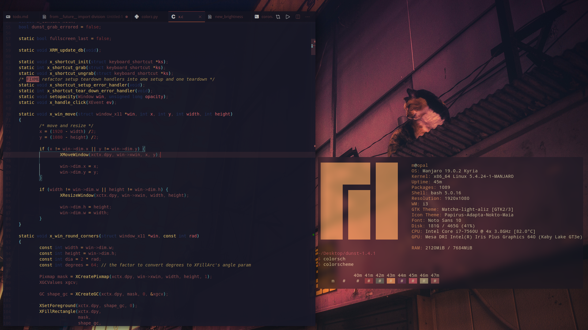

# ANSI-respecting k-means color palette generator

[](https://mybinder.org/v2/gh/bartlettmic/ansi-theme-engine/master?filepath=demo.ipynb)

This script tries to generate a color palette from an image for use with the ANSI spec in terminal emulators. It uses a biased flavor of the k-means algorithm to find the closest pixels in an image that correspond to hard 3-bit colors but still respects the aesthetic of theimage's colorspace.

## Usage:
See [`demo.ipynb`](https://mybinder.org/v2/gh/bartlettmic/ansi-theme-engine/master?filepath=demo.ipynb) for a visualized explanation of how the color palette is generated.

Otherwise, try:

```bash
python3 kmeans.py path/to/image <how many times to iterate k-means>
```
e.g.

```bash
python3 kmeans.py ~/Pictures/wallpaper.jpg 10
```
There is also a shell script named `themer` that fetches the current wallpaper if you are using nitrogen, and spits out an Xresources file plus a color-configuration for the Kitty terminal emulator. I am able to achieve the below aesthetic by using the Kitty terminal with a hot-reload of its color palette from that script, and a [Visual Studio Code theme that hot-reloads from an Xresources file](https://marketplace.visualstudio.com/items?itemName=JackVandergriff.xresources-theme):


